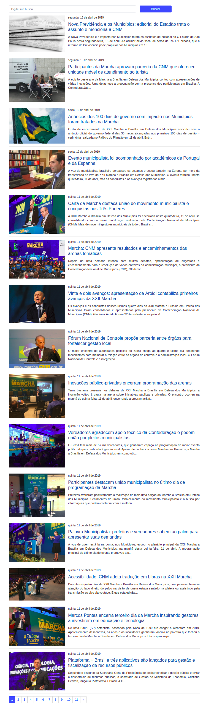

<h1>**Desafio 2**</h1>

#### Projeto desenvolvido com Laravel.

* Apresenta notícias de forma dinâmica (retornadas através da API).
* Fornece opção para que as notícias sejam filtradas (sendo possível pesquisar por palavras ou frases).
* Atende a todos os requisitos e ao layout solicitado (como paginação, formato da prévia e da data).

