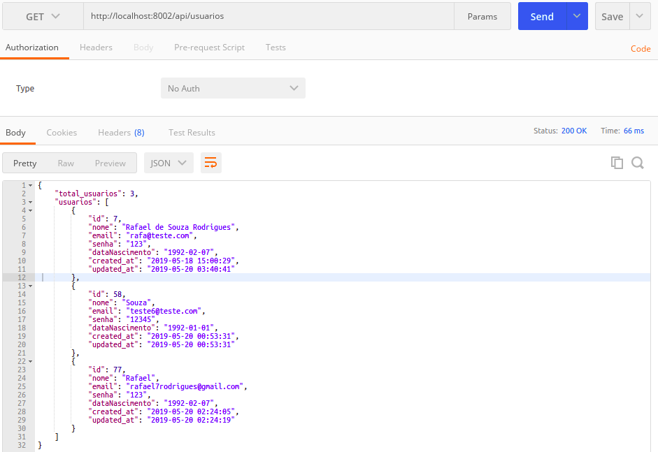
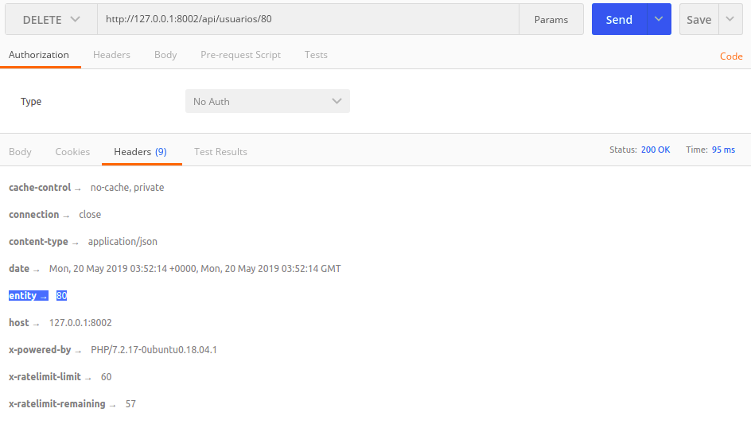
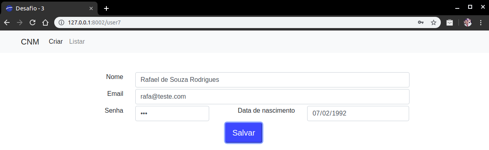
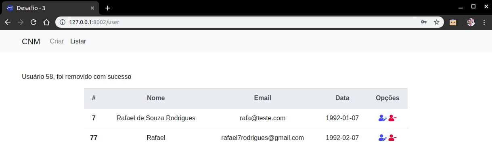

<h1>**Desafio 3**</h1>

<h2>Para executar projeto:</h2>
<ol>
    <li>Faça o clone do projeto</li>
    <li>Acesse a pasta "desafio-3" dentro do projeto</li>
    <li>Execute o comando "composer.install"</li>
    <li>Configure o arquivo ".env"</li>
    <li>Crie um database (com o nome definido no passo anterior)</li>
    <li>Execute o comando "php artisan migrate:refresh"</li>
    <li>Execute o comando "php artisan db:seed"</li>
    <li>Execute o comando "php artisan serve"</li>
</ol>
 

<h2>Resolução</h2>

<h3>Projeto desenvolvido com Laravel.</h3> 

<h4>CRUD</h4>
<ul>
   <li>Criação da tabela foi realizada por meio de migrations.
   <li>Os primeiros registros foram adicionados por meio de seeds.
</ul> 

<h4>Desenvolvimento de uma API</h4>
<ul>
   <li>Os dados também poderão ser acessados por meio de uma API desenvolvida.</li>
   <li>A ação requisitada pelo consumidor da API, deve ser feita por meio de verbos HTTP.</li>
</ul>

Método | Endpoint | Ação | Exemplo |
| --- | --- | --- | --- |
| GET | /usuarios | Retorna todos os usuários |  `http://localhost:8000/api/usuarios` |
| GET | /usuarios/{id} | Retorna usuário específico |  `http://localhost:8000/api/usuarios/1` |
| POST | /usuarios | Inesre novo usuário |  `http://localhost:8000/api/usuarios` |
| PUT | /usuarios/{id} | Atualiza dados de um usuário |  `http://localhost:8000/api/usuarios/1` |
| DELETE | /usuarios/{id} | Deleta um usuário |  `http://localhost:8000/api/usuarios/1` |

<h5>API em funcionamento:</h5>

 

   

<h4>Desenvolvimento front-end</h4>
<ul>
   <li>Com HTML e CSS, foram desenvolvidas telas, para facilitar uma interação do usuário com a base de dados.
</ul>

<h5>Imagens front-end:</h5>

 

